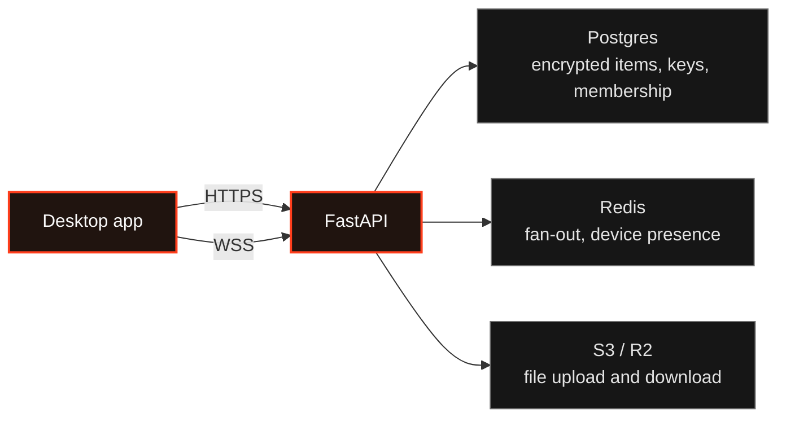

# Orange Copy Paste: sync server

The sync server for the [Orange Copy Paste desktop app](https://github.com/NotRover/RoverTools-Orange-Copy-Paste-App): a FastAPI service that stores users' encrypted clipboard entries and notes, sends changes to their other devices as they happen, and handles sharing between people in spaces.


It is a **stateless relay and store**. The app encrypts everything before sending it, so this server holds encrypted items, public keys and locked keys, and never a key that could open them. It does not sign anyone in either: Supabase Auth issues the tokens, and this server only checks them.

- **Runtime:** Python 3.14 or newer, FastAPI and uvicorn, managed with `uv`.
- **Data:** Supabase Postgres through async SQLAlchemy and asyncpg, with Alembic migrations.
- **Live updates:** WebSockets, fanned out across server copies through Redis pub/sub.
- **Files:** S3-compatible storage: Cloudflare R2 in production, MinIO in development.
- **Auth:** Supabase Auth tokens, checked with PyJWT.

The exact contract with the app, route by route, is in [`docs/architecture.md`](docs/architecture.md). To run your own instance for real use, follow [Self-hosting](https://orange-copy-paste-app.pages.dev/docs/developers/self-hosting/).

## Architecture at a glance



- **Sign-in is Supabase's job.** The app signs in with Supabase directly and sends the resulting token with every request. This server checks it against the project's published keys, or the legacy shared secret on older projects. There is no login, refresh or password route here.
- **The newest edit wins.** When two devices change the same item, the later edit is kept. Deletes are markers on the item rather than a delete route, and a delete always wins a conflict.
- **Live updates scale out.** Each server copy holds its own WebSocket connections and listens on Redis, and any copy can publish, so every copy delivers. No sticky sessions are needed behind a load balancer.
- **Files skip the server.** The app uploads and downloads files directly from storage through short-lived links. The server only issues the links, tracks quota, and cleans up uploads that were never confirmed.
- **Background work runs in-process.** One copy takes a Postgres lock and becomes the leader: it clears stale device presence every minute and orphaned files every hour. There is no separate job queue.

## Run it locally

You need Python 3.14 or newer, [`uv`](https://docs.astral.sh/uv/), Docker, and a Supabase project for sign-in.

1. Copy the example settings and set `SUPABASE_URL` to your project's URL. The other values have working local defaults.
   ```bash
   cp .env.example .env
   ```
2. Start the server with Postgres, Redis and MinIO beside it. The API listens on port 8000, and the MinIO console on port 9001 (`minioadmin` / `minioadmin`).
   ```bash
   docker-compose up
   ```
   Or run the API on your computer against those services:
   ```bash
   uv run uvicorn src.main:app --reload
   ```
3. Create the tables:
   ```bash
   uv run alembic upgrade head
   ```
4. Check it is running:
   ```bash
   curl http://localhost:8000/internal/healthz
   ```
   A healthy server answers with status 200.

To browse the API at `/api/docs` (Swagger), `/api/redoc`, or the schema at `/api/openapi.json`, set `DOCS_ENABLED=true` in `.env`. It is off by default, so a deployment never publishes them by accident.

To test file uploads from the real app, run the API on your computer rather than in Docker, with `S3_ENDPOINT_URL=http://localhost:9000`. Inside Docker, upload links point at the `minio` host name, which the app on your computer cannot reach.

## Configuration

All settings come from environment variables or `.env`. Defaults are in `src/config.py`, and each variable is explained in [`.env.example`](.env.example).

| Variable | What it is for |
| --- | --- |
| `DATABASE_URL` | Postgres connection with the asyncpg driver. Use Supabase's connection pooler in production. |
| `REDIS_URL` | Fan-out and device presence. Use `rediss://` for a TLS endpoint. |
| `SUPABASE_URL` | Required. Identifies the project, and where its token-signing keys are published. |
| `SUPABASE_JWT_SECRET` | Legacy shared secret. Leave it blank for projects that sign tokens with published keys; both kinds are accepted. |
| `SUPABASE_JWT_AUDIENCE` | The expected token audience, `authenticated` by default. |
| `SUPABASE_SERVICE_ROLE_KEY` | Server only. Lets admin tools ban or delete accounts. Never give it to an app. |
| `S3_ENDPOINT_URL`, `S3_BUCKET`, `AWS_*` | File storage. |
| `APP_CORS_ORIGINS` | Allowed origins, comma separated. |
| `DEFAULT_BLOB_QUOTA_BYTES` | File storage per user, 50 MB by default, and changeable per user through the admin API. |
| `EMAIL_PROVIDER`, `BREVO_API_KEY` or `SMTP_*`, `EMAIL_FROM` | Email for space invites only. Supabase sends sign-up and password emails. |
| `ADMIN_API_KEY` | Unlocks the metrics and admin endpoints. Leave it empty to turn them off. |
| `DOCS_ENABLED` | Serves the interactive API docs. Off by default. |

## What the API covers

Product routes are versioned and get their prefixes from `src/version.py`; health and metrics probes are not versioned, because load balancers and scrapers hard-code their paths.

- **auth:** account setup, storing the locked master key and recovery copy, device registration, and public keys.
- **sync:** push, pull and a per-type breakdown.
- **settings:** one encrypted settings blob per user.
- **blobs:** file upload and download links, confirmation, and quota.
- **spaces** and **invites:** spaces, membership, join requests, invites, and handing out space keys.
- **realtime:** the WebSocket that carries live changes and presence.
- **ops and admin:** health and metrics probes, and a management API behind an admin key.

Every route, payload and socket event is in [`docs/architecture.md`](docs/architecture.md). This README leaves them out on purpose, so it cannot drift from the contract.

## Rules shared with the app

Changing one side means changing the other, and updating `docs/architecture.md` in the same change.

- Routes that act for a device need both the sign-in token and the device's ID. Checking them lives once, in `src/dependencies.py`; routes depend on it instead of reading tokens themselves.
- Deletes are markers on the item, never a delete route.
- The server cannot read content, and holds no key that could open it.
- Space keys are made by the app and locked for each member. Changing members triggers a new key from the app, never key handling on the server.

## Project structure

```text
src/
|- main.py              app setup: middleware, routes, startup and shutdown
|- version.py           API and service versions, and route prefixes
|- config.py            settings
|- dependencies.py      token and device checks, shared by every route
|- middleware.py        security headers, the API version header
|- database.py          database engine and sessions
|- redis_client.py      Redis connection pool
|- limiter.py           rate limiting
|- background.py        leader-only maintenance: presence and orphaned files
|- realtime.py          WebSocket endpoint, fan-out, presence
|- email.py             invite email through Brevo or SMTP
|- supabase_admin.py    Supabase admin calls (ban, delete)
|- auth/                accounts, setup, devices, public keys; tokens.py checks tokens
|- sync/                push, pull and conflict handling
|- settings/            the encrypted settings blob
|- spaces/              spaces, invites, join requests, key handover
|- blobs/               file links and quota
|- announcements/       messages from the server to users
|- admin/               probes and the management API
`- web/                 web pages people open in a browser (templates/)

migrations/versions/    Alembic migrations
tests/                  pytest, one module per area
docs/                   architecture.md, DEPLOY.md, ANNOUNCEMENTS.md
```

Routes stay thin: HTTP handling in the route, logic in the service beside it.

## Develop

| Task | Command |
| --- | --- |
| Lint | `uv run ruff check src` |
| Check types | `uv run ty check src` |
| Run the tests | `uv run pytest` |
| Run the server with reload | `uv run uvicorn src.main:app --reload` |
| Write a new migration | `uv run alembic revision -m "description"` |
| Apply migrations locally | `uv run alembic upgrade head` |

Always go through `uv run`: `ruff` and `ty` are not on the virtual environment's path. Both must pass for any Python change, and logic changes need tests. `# type: ignore` is only acceptable for a documented false positive in a third-party library's types.

The tests replace Redis with `fakeredis` and make their own tokens, but they need a Postgres database named `clipboard_test`, or whatever `TEST_DATABASE_URL` points at. Create it once:

```bash
docker-compose exec db createdb -U postgres clipboard_test
```

**Deploying never applies migrations.** Write them freely, but applying one to a real database is a separate, deliberate step.

## Deployment

Production runs in Docker on a small server: Caddy for TLS in front of the FastAPI service, with Redis beside it. Supabase and Cloudflare R2 are external. A timer on the server checks `main`, and on a new commit builds the image there and restarts the container. With one copy running, a deploy can drop requests for a second or two and make live connections reconnect once; that trade-off is deliberate. The `Dockerfile` also runs as-is under plain `docker run`.

The full setup, from Supabase and R2 to migrations, Caddy and the deploy timer, is in [`docs/DEPLOY.md`](docs/DEPLOY.md). A shorter public version is [Self-hosting](https://orange-copy-paste-app.pages.dev/docs/developers/self-hosting/).

## Further reading

- [`docs/architecture.md`](docs/architecture.md): routes, payloads, data model and socket events. The reference for the contract.
- [`docs/DEPLOY.md`](docs/DEPLOY.md): how the production server is set up, deployed and run.
- [`docs/ANNOUNCEMENTS.md`](docs/ANNOUNCEMENTS.md): how to send a message to users, and how to word it.
- The app's [architecture doc](https://github.com/NotRover/RoverTools-Orange-Copy-Paste-App/blob/main/orange-copy-paste-clipboard-app-rust/docs/architecture.md): how the app uses this API.

## Contributing

Setup, checks and pull request rules are in [CONTRIBUTING.md](CONTRIBUTING.md). Report vulnerabilities as described in [SECURITY.md](SECURITY.md), never in a public issue. See also the [CODE_OF_CONDUCT.md](CODE_OF_CONDUCT.md). Licensed under the [GNU AGPL v3.0](LICENSE).
