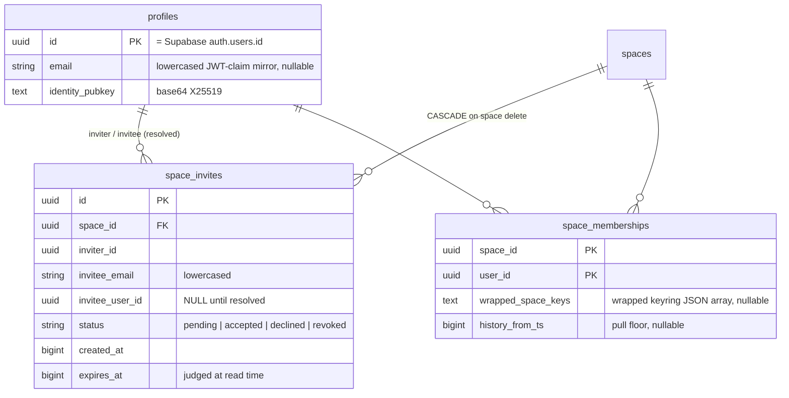
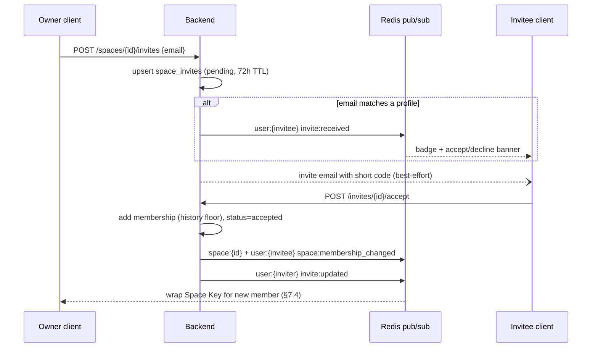
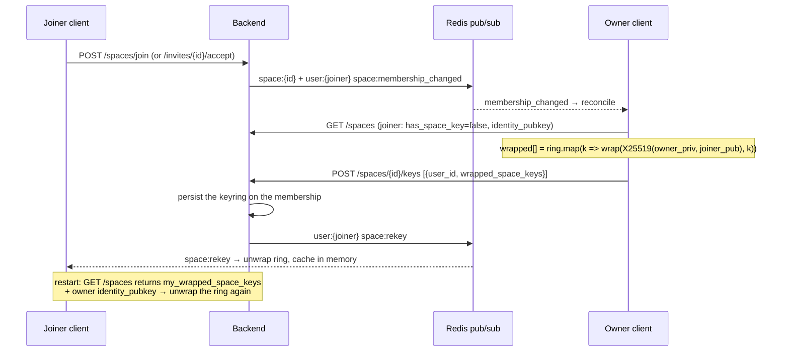

# Orange Clipboard — Backend Architecture

> **Project:** RoverTools Smart Clipboard Backend
> **Status:** Implemented — reflects current source
> **Last updated:** 2026-08-16
> **Stack:** FastAPI + Supabase (Postgres + Auth) + Redis + S3-compatible blob storage

---

## Table of Contents

1. [System Overview](#1-system-overview)
2. [Service Boundaries](#2-service-boundaries)
3. [Tech Stack](#3-tech-stack)
4. [Data Models](#4-data-models)
5. [API Design](#5-api-design)
6. [Sync Strategy](#6-sync-strategy)
7. [E2E Encryption Design](#7-e2e-encryption-design)
8. [Realtime Architecture](#8-realtime-architecture)
9. [Auth Flow](#9-auth-flow)
10. [Background Maintenance](#10-background-maintenance)
11. [Deployment Model & Cost](#11-deployment-model--cost)
12. [Desktop App Integration](#12-desktop-app-integration)
13. [Directory Layout](#13-directory-layout)
14. [Client / Backend Contract Drift](#14-client--backend-contract-drift)
15. [Spaces Design](#15-spaces-design)
16. [Security Checklist](#16-security-checklist)

---

## 1. System Overview

The backend is a **stateless FastAPI application** that leans on **Supabase for
Postgres + Auth** and keeps everything else vendor-neutral. Because the API holds
no per-connection state that other instances need (realtime fan-out and presence
are coordinated through Redis), it **scales horizontally** — run N replicas behind
a load balancer, no sticky sessions.

Two moving parts you operate (FastAPI + Redis); the rest is managed:

```
┌──────────────────────────────────────────────────────────────────┐
│                       Tauri Desktop App                            │
│   ├─ Supabase Auth (GoTrue)  ── register / login / refresh / reset │
│   ├─ HTTP  ── /api/v1/*   (Authorization: Bearer <supabase JWT>,    │
│   │                        X-Device-Id: <device>)                  │
│   └─ WS    ── /ws?token=<supabase JWT>&device_id=<device>          │
└───────────────┬──────────────────────────────────┬────────────────┘
                │                                   │
        ┌───────▼────────────────┐         ┌────────▼───────────────────────┐
        │  FastAPI (stateless ×N) │──SQL──► │  SUPABASE (managed)             │
        │  auth · sync · settings │  verify │   • Postgres (app schema)       │
        │  blobs · spaces+invites │  JWT──► │   • Auth (users, sessions,      │
        │  /ws realtime · admin   │         │     email verify, pwd reset)    │
        └───┬───────────────┬─────┘         └─────────────────────────────────┘
            │               │
     ┌──────▼─────┐  ┌──────▼────────────────┐
     │  Redis     │  │  S3-compatible (R2)    │
     │  pub/sub   │  │  image / file blobs    │
     │  + presence│  │  (MinIO in dev)        │
     └────────────┘  └────────────────────────┘
```

- **Supabase** owns the database and the identity layer. It is the only intentional
  vendor lock-in.
- **FastAPI** owns the app-specific logic: the sync engine, spaces + E2E key
  distribution, blob upload brokering, presence, and its own WebSocket.
- **Redis** does exactly two things: realtime pub/sub fan-out and device presence.
- **R2** (or any S3-compatible store) holds encrypted binary blobs. Vendor-neutral.
- **No Celery / no worker service.** Background jobs run in-process under a Postgres
  advisory lock (see §10). Email is sent via FastAPI `BackgroundTasks`.

The desktop app remains fully functional offline; sync is opportunistic and resumes
on reconnect.

---

## 2. Service Boundaries

Each package under `src/` owns a router + service (+ models/schemas). They call each
other in-process.

### 2.1 Auth-adjacent (`src/auth/`)

Registration, email verification, login, token refresh, and password reset are
handled by **Supabase Auth** — the client talks to Supabase directly. This module
owns only what the app itself must store:

- **Profile bootstrap** — get-or-create the app profile for a Supabase user and
  return the KDF salt + wrapped-UMK envelope the client unwraps to recover its key.
- **Device registration** — each install registers a device row (carries the device
  public key and, later, the wrapped UMK); returns a `device_id` the client sends
  back as `X-Device-Id`.
- **Public-key management** — store the user's X25519 identity key and per-device
  wrapped UMK for multi-device E2E.

The backend never issues tokens; it only **verifies** the Supabase JWT (HS256,
project secret) on protected routes.

### 2.2 Sync (`src/sync/`)

Owns `sync_entries` (clipboard + notes) and per-device `sync_cursors`.

- Delta push (batches of new/mutated entries) with last-write-wins + tombstones.
- Delta pull since a cursor, covering the caller's own entries **plus** anything
  shared into a space they belong to (subject to that membership's history floor).
- Publishes `sync:entry` to Redis after a write — once to the author's `user:` channel
  and once to each `space:` channel named in the entry's `space_ids`. There is no
  `sync:delete`: a tombstone is a normal `sync:entry` with `deleted_at` set.
- Carries two server-visible routing/key columns it never interprets:
  `space_ids` (fan-out targets) and `wrapped_keys` (the per-entry CEK envelope, §7.2).

### 2.3 Settings (`src/settings/`)

One encrypted blob per user (`user_settings`), last-write-wins by `updated_at`. On a
client-wins write, publishes `settings:updated` so other devices pull.

### 2.4 Blobs (`src/blobs/`)

Brokers direct-to-object-store uploads.

- `request-upload` → presigned PUT URL + `blob_key` (server never buffers bytes).
- `confirm-upload` → marks the blob confirmed.
- `{blob_key}/download-url` → presigned GET URL.
- `quota` → usage (computed on demand: `SUM(size_bytes)` over confirmed blobs) and
  the per-user quota.
- **5 MB per-entry hard cap**; per-user quota default **50 MB** (configurable
  globally and per-user via the admin API).

### 2.5 Spaces (`src/spaces/`)

A **space** is the single sharing primitive: a named, persistent, realtime room whose
entries are encrypted under a Space Key the server never sees. There is no space *type*,
no member cap, and no server-side scope. See §15.

- **Spaces** (`router.py` / `service.py` / `models.py` / `schemas.py`) — create, list,
  get, join by invite code, remove member / leave, delete, and per-member Space Key
  distribution.
- **Addressed invites** (`invites.py`) — one persistent row per (space, invitee email)
  with accept / decline / revoke and live `invite:*` events, alongside the bearer
  invite code. Mounted separately under `/api/v1/invites`.

What flows *into* a space (send filters) and what a receiving client does with an
incoming entry (auto-copy) are client-side choices stored in the encrypted settings
blob. The server only routes ciphertext.

### 2.6 Realtime (`src/realtime.py`)

Single module: the WebSocket endpoint, an in-process connection hub, the Redis
pub/sub bridge, the publish helpers, and device presence. See §8.

### 2.7 Admin (`src/admin/`)

Ops-only, gated by `X-Admin-Key` (disabled → 503 if `ADMIN_API_KEY` unset), except
the public `/internal/healthz`.

- Health, Prometheus metrics, JSON stats (counts from our tables; online-device
  count from Redis presence; storage computed on demand).
- User management over `profiles` (list/detail/quota). **Account state**
  (email, verification, suspension/ban, deletion) is owned by Supabase and delegated
  to the Supabase Admin API (`src/supabase_admin.py`); those calls require
  `SUPABASE_SERVICE_ROLE_KEY`.

---

## 3. Tech Stack

| Concern            | Choice                                | Reason                                                           |
| ------------------ | ------------------------------------- | ---------------------------------------------------------------- |
| API framework      | FastAPI + uvicorn                     | Async, Pydantic v2, native WebSocket, auto OpenAPI               |
| Database           | Supabase **Postgres 16**              | Managed; asyncpg + SQLAlchemy 2 async core; RLS available        |
| Identity / Auth    | Supabase **Auth (GoTrue)**            | Managed signup, email verify, password reset, sessions, JWTs     |
| JWT verification   | PyJWT — **ES256/RS256 via JWKS**, legacy HS256 | We verify only; Supabase signs. Asymmetric by default, symmetric accepted when `SUPABASE_JWT_SECRET` is set |
| Cache / realtime   | Redis 7                               | Pub/sub fan-out + device presence (nothing else)                 |
| Blob storage       | Cloudflare **R2** (S3-compatible)     | Direct presigned PUT/GET; zero egress; MinIO for local dev       |
| Background jobs    | in-process asyncio + PG advisory lock | Presence sweep + orphan blob cleanup; no Celery/broker           |
| Email              | Brevo REST (default) or stdlib SMTP   | Space invites only; via `BackgroundTasks`                        |
| KDF (E2E)          | Argon2id (client-side)                | Memory-hard; password → key-wrapping key for the random UMK      |
| Content encryption | AES-256-GCM (client-side)             | AEAD; per-entry content key, server stores ciphertext only       |
| Key exchange       | X25519 (client-side)                  | Multi-device UMK wrapping + Space Key wrapping                   |

**Core Python dependencies** (`pyproject.toml`):

```
fastapi, uvicorn[standard], pydantic, pydantic-settings,
sqlalchemy[asyncio], asyncpg, alembic,
redis[hiredis], boto3, pyjwt[crypto],
python-multipart, httpx, slowapi, email-validator
```

There is **no** `celery`, `python-jose`, or `passlib` dependency. `cryptography`
comes in only as `pyjwt[crypto]`, which PyJWT needs to verify Supabase's asymmetric
(ES256/RS256) tokens — the server verifies tokens it never signs, and every
content-encryption operation is client-side.

---

## 4. Data Models

All server-assigned IDs are UUID v4. Timestamps are `BIGINT` milliseconds since the
Unix epoch (to match the Tauri app's `u64`). `client_id` is stored as `TEXT` and
carries the app's own entry ID — itself a UUID v4 — which is what dedup keys on.

### 4.1 `profiles`

The app-side record for a Supabase Auth user. `id` **equals** the Supabase
`auth.users.id` (the JWT `sub`); linkage is application-level (no cross-schema FK).
Email, password, and verification state live in Supabase — not here.

```sql
CREATE TABLE profiles (
    id               UUID PRIMARY KEY,            -- = auth.users.id
    display_name     TEXT NOT NULL DEFAULT '',
    kdf_salt         TEXT NOT NULL,               -- base64; Argon2id salt for the wrapping key
    identity_pubkey  TEXT,                        -- base64 X25519 public key (E2E)
    pw_wrapped_umk   TEXT,                        -- base64; random UMK wrapped under the KEK
    blob_bytes_quota BIGINT NOT NULL DEFAULT 52428800,  -- 50 MB
    created_at       BIGINT NOT NULL,
    updated_at       BIGINT NOT NULL
);
```

Storage used is **not** stored — it is computed on demand from confirmed blobs.

### 4.2 `devices`

```sql
CREATE TABLE devices (
    id            UUID PRIMARY KEY DEFAULT gen_random_uuid(),
    user_id       UUID NOT NULL,          -- profiles.id
    device_name   TEXT NOT NULL DEFAULT '',
    platform      TEXT NOT NULL,          -- 'windows' | 'linux' | 'macos'
    app_version   TEXT NOT NULL DEFAULT '',
    device_pubkey TEXT,                    -- base64 X25519 public key
    wrapped_umk   TEXT,                    -- AES-GCM(shared_secret, UMK); set by a peer device
    revoked       BOOLEAN NOT NULL DEFAULT false,
    created_at    BIGINT NOT NULL,
    last_seen_at  BIGINT NOT NULL
);
CREATE INDEX idx_devices_user_id ON devices(user_id);
```

Session/refresh lifecycle is owned by Supabase. `revoked` is a soft flag for the
device-management UX (revoking also clears `wrapped_umk`).

### 4.3 `sync_entries`

```sql
CREATE TABLE sync_entries (
    id                 UUID PRIMARY KEY DEFAULT gen_random_uuid(),
    client_id          TEXT NOT NULL,
    user_id            UUID NOT NULL,
    device_id          UUID NOT NULL,
    entry_type         TEXT NOT NULL,      -- 'clipboard' | 'note'
    kind               TEXT,               -- 'text'|'image'|'html'|'file'
    encrypted_content  TEXT NOT NULL,      -- base64 AES-256-GCM ciphertext (key = the entry's CEK)
    encrypted_metadata TEXT,               -- base64 AES-256-GCM: label/title, pinned, local group names
    created_at         BIGINT NOT NULL,    -- client-originated
    updated_at         BIGINT NOT NULL,    -- client-originated (notes order by this)
    server_ts          BIGINT NOT NULL,    -- server-assigned; the sync cursor
    deleted_at         BIGINT,             -- tombstone (NULL = alive)
    pinned             BOOLEAN NOT NULL DEFAULT false,
    space_ids          UUID[] NOT NULL DEFAULT '{}',   -- server-visible; the fan-out targets
    wrapped_keys       TEXT NOT NULL DEFAULT '{}',     -- CEK envelope; opaque JSON map (§7.2)
    blob_key           TEXT,               -- object key; NULL for text
    blob_size          BIGINT,
    CONSTRAINT uniq_client_entry UNIQUE (user_id, client_id, entry_type)
);
CREATE INDEX idx_sync_entries_user_ts ON sync_entries(user_id, server_ts);
CREATE INDEX idx_sync_entries_device  ON sync_entries(device_id);
CREATE INDEX idx_sync_entries_spaces  ON sync_entries USING GIN(space_ids);
```

`space_ids` is the only sharing fact the server reads: it decides which `space:`
channels a write fans out to and which memberships can pull the row. `wrapped_keys`
is stored and echoed verbatim — the server cannot tell one wrap from another, and a
row whose `space_ids` is empty is a personal entry. A tombstone keeps the
`space_ids` the entry had, so a delete reaches the same members the entry did.

### 4.4 `sync_cursors`

```sql
CREATE TABLE sync_cursors (
    device_id      UUID PRIMARY KEY,
    user_id        UUID NOT NULL,
    last_server_ts BIGINT NOT NULL DEFAULT 0
);
```

### 4.5 `user_settings`

```sql
CREATE TABLE user_settings (
    user_id        UUID PRIMARY KEY,
    encrypted_blob TEXT NOT NULL,   -- AES-256-GCM(UMK, JSON of synced preferences)
    updated_at     BIGINT NOT NULL  -- client-originated; used for LWW
);
```

### 4.6 `spaces`

```sql
CREATE TABLE spaces (
    id                UUID PRIMARY KEY DEFAULT gen_random_uuid(),
    owner_id          UUID NOT NULL,      -- profiles.id
    name              TEXT NOT NULL,
    invite_code       TEXT UNIQUE,        -- bearer secret; 8 chars, 72 h TTL
    invite_expires_at BIGINT,
    share_history     BOOLEAN NOT NULL DEFAULT true,  -- may later joiners read older entries?
    created_at        BIGINT NOT NULL
);
CREATE INDEX idx_spaces_owner_id ON spaces(owner_id);
```

There is no space *type* and no member cap. `invite_code` is drawn from
`ABCDEFGHJKMNPQRSTUVWXYZ23456789` (no I/L/O/0/1) so it survives being read aloud or
retyped; the API normalizes case and strips `-`/spaces on join, and displays it as
`KX7Q-2M4X`. Anything longer than 8 characters is treated as a legacy
`token_urlsafe` code and matched case-sensitively.

`share_history` is resolved into the joining member's `history_from_ts` **at join
time**, so flipping it later does not retroactively widen what an existing member can
pull.

### 4.7 `space_memberships`

```sql
CREATE TABLE space_memberships (
    space_id           UUID NOT NULL,     -- CASCADE on space delete
    user_id            UUID NOT NULL,
    role               TEXT NOT NULL DEFAULT 'member',  -- 'owner' | 'member'
    wrapped_space_keys TEXT,      -- JSON array of X25519-wrapped Space Keys, newest first (§7.4)
    history_from_ts    BIGINT,    -- pull floor; NULL = full history
    joined_at          BIGINT NOT NULL,
    PRIMARY KEY (space_id, user_id)
);
CREATE INDEX idx_sm_user ON space_memberships(user_id);
```

`role` has exactly two values. There is no `share_scope` column: filtering what a
device sends into a space is a client-side setting the server never learns.

`wrapped_space_keys` is a wrapped **keyring**, not a single key — a JSON array,
newest key first, each element an X25519-wrapped copy for this member. It is an array
because a rekey must not make older entries unreadable: previous Space Keys exist
nowhere else, so a member who restarts after a rekey recovers the whole ring and can
still decrypt entries written under earlier keys. `NULL` is meaningful — it is the
signal that this member needs a (re)distribution (§7.4).

### 4.8 `blobs`

```sql
CREATE TABLE blobs (
    key         TEXT PRIMARY KEY,
    user_id     UUID NOT NULL,
    mime_type   TEXT NOT NULL,
    size_bytes  BIGINT NOT NULL,
    checksum    TEXT NOT NULL,       -- SHA-256 hex
    confirmed   BOOLEAN NOT NULL DEFAULT false,
    created_at  BIGINT NOT NULL
);
```

> **Migration note:** `migrations/0006_supabase_migration.py` renames `users` →
> `profiles`, drops the Supabase-owned columns (`email`, `password_hash`,
> `email_verified`, `suspended_at`) plus the denormalized `blob_bytes_used`, drops
> `devices.refresh_token_hash` and `blobs.entry_id`, makes `groups.max_members`
> nullable (NULL = unlimited), and lowers the default quota to 50 MB. Migrations
> 0001–0005 remain the historical chain.

> **Migration note (0011, spaces):** `migrations/versions/0011_spaces.py` drops
> `groups` / `group_memberships` / `group_invites` and creates `spaces` /
> `space_memberships` / `space_invites`, renames `sync_entries.group_ids` →
> `space_ids` (rebuilding the GIN index), and adds `sync_entries.wrapped_keys`.
> It is **destructive on purpose**: the old tables are dropped rather than renamed,
> and `sync_entries` is `TRUNCATE`d because pre-CEK ciphertext was encrypted directly
> under the UMK or a Group Key and cannot be read under the envelope. `downgrade()`
> restores the old *shape*, not the data. This migration is **written but not
> applied** — applying it needs explicit approval.

---

### 4.9 `space_invites`

Addressed counterpart to the bearer `invite_code`: one row per
(space, invitee email), so an invitation survives the invitee being offline and
the inviter can see its fate. `profiles.email` (added in migration 0009) is the
lowercased mirror of the Supabase JWT email claim, captured at bootstrap, used to
resolve invitees to user ids locally.



---

## 5. API Design

### Conventions

- Base URL: `/api/v1`
- Auth: `Authorization: Bearer <supabase access token>` on all protected routes.
- Device scope: `X-Device-Id: <device_id>` header on device-scoped routes (sync,
  settings, key registration). Bootstrap and device registration do **not** require it.
- Errors: `{"detail": "..."}` + HTTP status.
- Pagination: cursor-based — `?after_ts=<server_ts>&limit=200`.

### 5.0 Versioning

Source of truth: `src/version.py` (`API_VERSION`, `SERVICE_VERSION`).

- **Product API is versioned** in the path: client-facing under `/api/v1`, admin
  under `/internal/v1`. `API_VERSION` bumps (`v2`, …) only on a
  backwards-incompatible contract change; `v1` and `v2` run side by side during a
  migration window.
- **Infra probes are intentionally unversioned**: `/internal/healthz` and
  `/internal/metrics`. Load balancers and Prometheus hardcode these paths and must
  not track a version on each bump.
- **`SERVICE_VERSION`** (semver, e.g. `2.0.0`) is the deployable build version and
  the OpenAPI `version`; it changes freely per release without implying a contract break.
- Every HTTP response carries an **`X-API-Version`** header (= `API_VERSION`).
- **Live schema:** Swagger UI at `/api/docs`, ReDoc at `/api/redoc`, raw spec at
  `/api/openapi.json`. Every route declares a Pydantic `response_model` and a
  docstring (surfaced as OpenAPI summary/description); tags group the surface
  (auth, sync, settings, blobs, spaces, invites, realtime, ops, admin). The WebSocket `/ws`
  contract is documented in §5.8 (FastAPI does not emit WebSockets into OpenAPI).

### 5.1 Auth Routes

```
POST   /api/v1/auth/bootstrap
       Body: { display_name? }
       Returns: { user_id, kdf_salt, display_name, wrapped_umk? }
       Idempotent: creates the profile on first call, generates the stable KDF salt,
       and returns it plus the wrapped-UMK envelope (null on a brand-new account).
       Call right after Supabase login.

PUT    /api/v1/auth/umk
       Body: { wrapped_umk }     -- random UMK wrapped under the password-derived key
       Stores the envelope on first setup (and on password change). Server holds only
       the wrapped blob, never the key.

POST   /api/v1/auth/devices
       Body: { device_name?, platform?, app_version?, device_pubkey? }
       Returns: 201 { device_id }     -- store and send back as X-Device-Id

GET    /api/v1/auth/devices
       Returns: [{ id, device_name, platform, app_version, last_seen_at }]

DELETE /api/v1/auth/devices/{device_id}         -- soft-revoke; clears wrapped_umk

POST   /api/v1/auth/keys/register               -- requires X-Device-Id
       Body: { identity_pubkey, device_pubkey }  (base64 X25519)

GET    /api/v1/auth/umk/device                  -- requires X-Device-Id
       Returns: { wrapped_umk }   -- the UMK wrapped for the calling device;
       the silent session-restore path. 404 when no wrap is stored or the device
       was revoked, which is what makes revocation cut a device off for real.

POST   /api/v1/auth/devices/{device_id}/key-wrap
       Body: { wrapped_umk }    -- an existing device wraps the UMK for another device
```

> Registration, email verification, login, refresh, and password reset are **not**
> here — the client performs them against Supabase Auth directly.

### 5.2 Sync Routes  (require `X-Device-Id`)

```
POST /api/v1/sync/push
     Body: { entries: [{ client_id, entry_type, kind?, encrypted_content,
             encrypted_metadata?, created_at, updated_at, pinned, deleted_at?,
             blob_key?, blob_size?, space_ids?, wrapped_keys? }] }
     Returns: { accepted: [{ client_id, server_id, server_ts }],
                conflicts: [{ client_id, reason: 'stale_update' }] }
     space_ids  — fan-out targets; default []. wrapped_keys — the CEK envelope as a
     JSON string, default "{}". Both are stored verbatim and never interpreted.

GET  /api/v1/sync/pull?after_ts=<ts>&limit=200&entry_type=all|clipboard|note
     Returns: { entries: [...], next_cursor: <ts | null> }
     Each entry echoes space_ids + wrapped_keys. Rows come from the caller's own
     user_id OR any space they belong to, per-membership history floor applied.

POST /api/v1/sync/cursor        Body: { last_server_ts }
```

There is no `GET /sync/status` and no delete route: the cursor is client-held (and
advanced with `POST /sync/cursor`), and a delete is a push with `deleted_at` set.

### 5.3 Settings Routes

```
GET  /api/v1/settings           Returns: { encrypted_blob, updated_at }  (404 if none)
PUT  /api/v1/settings           Body: { encrypted_blob, updated_at }
     Returns: { updated_at, winner: 'client'|'server', encrypted_blob }
```

### 5.4 Blob Routes

```
POST /api/v1/blobs/request-upload
     Body: { mime_type, size_bytes, checksum }
     Returns: { blob_key, presigned_put_url, expires_in_seconds }   (413 if > 5 MB;
               402 if over quota)

POST /api/v1/blobs/confirm-upload         Body: { blob_key }
GET  /api/v1/blobs/{blob_key}/download-url  Returns: { presigned_get_url, expires_in_seconds }
GET  /api/v1/blobs/quota                    Returns: { used_bytes, quota_bytes }
```

### 5.5 Spaces Routes  (require `X-Device-Id`)

```
POST   /api/v1/spaces                    Body: { name, share_history?: true }
       Returns: 201 { space_id, invite_code }   -- caller becomes owner, full history
GET    /api/v1/spaces                    Returns: [SpaceOut]   -- every space the caller is in
GET    /api/v1/spaces/{space_id}         Returns: SpaceOut      -- 403 if not a member
POST   /api/v1/spaces/join               Body: { invite_code } → { space_id, name }
       410 when the code has expired; idempotent if already a member.
DELETE /api/v1/spaces/{space_id}/members/{member_user_id}
       Owner removes a member, or a member removes themselves. 400 if the target is
       the owner (delete the space instead). Clears every remaining member's
       wrapped keyring to trigger a rekey (§7.4).
DELETE /api/v1/spaces/{space_id}         -- owner only; cascades memberships + invites
POST   /api/v1/spaces/{space_id}/invites Body: { email }   -- owner only; see §5.6
POST   /api/v1/spaces/{space_id}/keys    -- owner only
       Body: { wrapped_keyrings: [{ user_id, wrapped_space_keys }] }
       wrapped_space_keys is a JSON array string; stored verbatim on the membership.
```

`SpaceOut`:

```jsonc
{
  "id": "...", "owner_id": "...", "name": "...",
  "invite_code": "KX7Q2M4X", "invite_expires_at": 1234567, "share_history": true,
  "created_at": 1234567,
  "members": [{
    "user_id": "...", "display_name": "...", "avatar_url": null,
    "role": "owner|member", "joined_at": 1234567,
    "identity_pubkey": "base64 X25519 | null",  // null until that member registers keys
    "has_space_key": true,                      // holds a keyring? presence only, never the bytes
    "online": true                              // any device connected, from Redis presence
  }],
  "my_wrapped_space_keys": "[\"...\",\"...\"] | null"   // only ever the caller's own keyring
}
```

Three fields carry the key-distribution contract. `identity_pubkey` is what the owner
wraps for. `has_space_key` lets the owner wrap only for members who need one — without
it, every reconcile would re-distribute to everybody, the server would echo that back
as `space:rekey`, and clients would loop. `my_wrapped_space_keys` is the restart
recovery path, since Space Keys live in client memory only and `space:rekey` is
fire-and-forget. A member's keyring is never exposed to anyone else.

There is no rotate-invite-code route: a space's code is minted once at creation.

### 5.6 Invite Routes (addressed invites)

The bearer `invite_code` is complemented by persistent, per-email invites.
Lifecycle: `pending → accepted | declined` (invitee) `| revoked` (inviter);
expiry (72 h) is judged at read/accept time, no sweeper.

```
POST   /api/v1/spaces/{id}/invites   Body: { email }   -- owner only, requires X-Device-Id
       Returns: 201 { id, space_id, space_name, inviter_id, inviter_name,
                      invitee_email, status, created_at, expires_at }
       400 if it's the caller's own email; 409 if already a member.
       Refreshes an existing pending invite instead of stacking duplicates.
       Publishes invite:received to the invitee when resolvable; emails the code.
GET    /api/v1/invites               Returns: { sent: [...], received: [...] }
       received = pending, unexpired, matched by user id or the token's email claim
       sent = the caller's 50 most recent, any status, so outcomes are visible
POST   /api/v1/invites/{id}/accept   Joins the space; same events as a code join
POST   /api/v1/invites/{id}/decline
DELETE /api/v1/invites/{id}          -- inviter revokes a pending invite; needs X-Device-Id
```

`GET /invites` and the accept / decline routes authenticate on the bearer token alone,
because they match the caller against the token's `email` claim and are not device-scoped;
they do **not** require `X-Device-Id`. Revoke does, since it goes through the shared
device-scoped dependency.

Invitee resolution uses `profiles.email`, a lowercased mirror of the Supabase
JWT email claim captured at bootstrap (§4.9) — no Admin API round-trip.



### 5.7 Internal Routes

Split into **unversioned infra probes** and the **versioned admin API** (see §5.0).

```
-- Unversioned probes (paths are stable across API versions)
GET  /internal/healthz     Returns: { status, db, redis }   -- public, response_model=HealthResponse
GET  /internal/metrics     Prometheus text (X-Admin-Key)     -- excluded from OpenAPI (text/plain)

-- Versioned admin API (require X-Admin-Key)
GET  /internal/v1/stats       JSON aggregate
GET  /internal/v1/admin/users?offset=&limit=&search=<display_name>
GET  /internal/v1/admin/users/{user_id}      -- enriched with email/verified/banned when Supabase admin is configured
PATCH /internal/v1/admin/users/{user_id}/quota   Body: { blob_bytes_quota }
POST  /internal/v1/admin/users/{user_id}/suspend Body: { suspend: bool }   -- delegates to Supabase (ban/unban)
DELETE /internal/v1/admin/users/{user_id}        -- deletes profile (cascade) + Supabase user
```

Metrics: `orange_users_total`, `orange_devices_total`, `orange_devices_active_total`,
`orange_devices_online`, `orange_sync_entries_total`, `orange_sync_entries_deleted_total`,
`orange_blobs_total`, `orange_blobs_confirmed_total`, `orange_storage_bytes_used`,
`orange_redis_memory_bytes`.

### 5.8 WebSocket Event Protocol

**Connection:** `GET /ws?token=<supabase access token>&device_id=<device_id>`

The connection is subscribed to `user:<user_id>` and every `space:<space_id>` the
user belongs to. The channel set is resolved once at connect time and re-resolved on
demand (see `resubscribe` below).

**Server → Client events:**

```jsonc
{ "event": "sync:entry",   "payload": { ...SyncEntryOut } }   // incl. tombstones (deleted_at set)
{ "event": "device:online",  "payload": { "device_id": "..." } }   // user: channel; own devices
{ "event": "device:offline", "payload": { "device_id": "..." } }
{ "event": "user:presence",  "payload": { "user_id": "...", "online": true } }   // space: channels
{ "event": "space:entry_removed", "payload": { "space_id": "...", "client_id": "...", "entry_type": "clipboard|note", "author_id": "...", "removed_by": "..." } }
{ "event": "space:membership_changed", "payload": { "space_id": "...", "action": "joined|left|deleted", "user_id": "..." } }
{ "event": "space:rekey",  "payload": { "space_id": "...", "wrapped_space_keys": "[...]" } }
{ "event": "invite:received",      "payload": { ...InviteOut } }
{ "event": "invite:updated",       "payload": { "invite_id": "...", "status": "accepted|declined|revoked", "space_id": "..." } }
{ "event": "settings:updated",     "payload": { "updated_at": 1234567 } }
{ "event": "ping",         "payload": { "server_ts": 1234567 } }
```

Routing rules worth knowing when implementing a client:

- `sync:entry` is published once to `user:{author}` and once per `space:` channel in the
  entry's `space_ids`. Both carry the same payload, and the **origin device is excluded**
  from delivery, so a device never receives its own write back. A socket in a space it
  also authored into can therefore see the same entry twice — dedupe on
  `(client_id, entry_type)`.
- There is no `sync:delete`. A delete arrives as `sync:entry` with `deleted_at` set.
- `device:online` / `device:offline` are per-device and go only to the user's own
  channel. `user:presence` is the per-user fact addressed to that user's spaces, so
  other members' lists stay current without polling REST. `online: true` is published on
  **every** connect rather than only on the offline→online edge: a socket that dies
  without a close leaves its presence key alive for up to `PRESENCE_TTL`, so a client
  reconnecting inside that window looks like it never left and an edge-triggered publish
  would say nothing. `online: false` comes from the clean-close path and, for sockets
  that died without one, from the presence sweeper. Repeats are expected — a client
  drops an update that changes nothing.
- `space:entry_removed` carries both `author_id` and `removed_by`. They are equal when
  the author withdrew their own post and differ when the space owner took it down, and
  that is the only way a member can tell the two apart.
- `space:membership_changed` is published to the space channel **and** to the affected
  user's own channel, because the joiner is not on the space channel yet and a removed
  member may already be off it. `action: "deleted"` is published *before* the row is
  deleted, while the channel still has subscribers.
- `space:rekey` is addressed to one member's own channel and is fire-and-forget: nothing
  retries it. A client that was offline recovers the same keyring from
  `SpaceOut.my_wrapped_space_keys` on its next `GET /spaces`.

**Client → Server:** `{ "event": "pong" }` / `{ "event": "ack" }` (either refreshes
the presence TTL), and `{ "event": "resubscribe" }` — re-resolves the socket's
channel set after a membership change, so space fan-out starts (or stops)
without a reconnect.

---

## 6. Sync Strategy

### 6.1 Server-Timestamped Last-Write-Wins

- Server assigns a millisecond `server_ts` on every accepted write; it is the sync
  cursor.
- Conflict on `(user_id, client_id, entry_type)`: last writer wins. A push with an
  `updated_at` not newer than the stored row is rejected as `stale_update`.
- Tombstone wins: an incoming delete beats a concurrent live update.

### 6.2 Push / Pull

```
Push:  client → POST /sync/push [batch] → upsert (client_id dedup), assign server_ts,
       publish sync:entry to user:{author} + space:{id} for each space_id
       → { accepted, conflicts }
Pull:  client → GET /sync/pull?after_ts=<cursor>&limit=200
       server → rows WHERE server_ts > cursor
                AND ( user_id = me
                      OR space_ids && ARRAY[<one space I'm in>]        -- one arm per membership,
                         [AND server_ts >= that membership's history_from_ts] )
                ORDER BY server_ts ASC (+1 for next_cursor)
       repeat until next_cursor = null → POST /sync/cursor
```

The space arm is not redundant with the WebSocket. Without it, an entry another member
pushed while this device was offline would never arrive at all — live fan-out is the
only other delivery path. The history floor is applied per membership, since the same
caller may have full history in one space and post-join-only in another.

`server_ts` is assigned per accepted entry from wall-clock milliseconds, so a batch does
not share one timestamp. Cursor comparisons are strict (`>`) on pull and the cursor
write only moves forward (`POST /sync/cursor` ignores a lower value).

### 6.3 Offline Operation

Local `history.bin` / `notes.bin` are the source of truth. The sync client pulls on
startup/reconnect, queues pushes while offline, and applies WS events as they arrive.

---

## 7. E2E Encryption Design

The invariant: entry payloads reach the server (and Supabase) as **ciphertext only** —
never plaintext content, note titles, or labels. All key material is generated, wrapped,
and unwrapped on the client. Space *names* are the deliberate exception: `spaces.name` is
plaintext, because an invitee is shown the space name before they join and therefore
before they hold any key that could decrypt it. See §7.5 for the full visibility list.

### 7.1 User Master Key (UMK) — envelope model

The UMK is a **random 32-byte key**, not derived from the password. The password
only derives a **key-wrapping key (KEK)** that wraps/unwraps the UMK:

```
KEK          = Argon2id(password, kdf_salt, m=65536, t=3, p=4) → 32 bytes
wrapped_umk  = AES-256-GCM(KEK, UMK)          -- the envelope, stored server-side
UMK          = AES-256-GCM-open(KEK, wrapped_umk)   -- recovered on login
```

- **First setup:** the client generates a random UMK, wraps it under the KEK, and
  stores the envelope via `PUT /auth/umk`.
- **Return / new device:** the client fetches `wrapped_umk` from `bootstrap`, derives
  the KEK from the entered password, and unwraps. A GCM auth failure = wrong password.

Decoupling the key from the password means a **password change only re-wraps the
UMK** (one `PUT /auth/umk`) instead of re-encrypting all data — and the same random
UMK can later be wrapped additional ways (per-device transfer, recovery code) without
re-keying. The server holds only the wrapped envelope; the UMK lives in memory only.

### 7.2 Content Encryption — the per-entry CEK envelope

Content is **not** encrypted under the UMK or under a Space Key. Every entry gets its own
random 32-byte **content encryption key (CEK)**; the content is encrypted exactly once
under it, and the CEK is then wrapped once per reader:

```
CEK          = 32 random bytes                                   -- per entry, never reused
encrypted_content   = base64( nonce(12B) || AES-256-GCM(key=CEK, content, aad=client_id) )
encrypted_metadata  = same construction, same CEK

wrapped_keys = {                                    -- JSON map, stored as TEXT
  "personal":   wrap(UMK,          CEK),            -- always present; the author's own copy
  "<space_id>": wrap(SpaceKey_now, CEK),            -- one per entry in space_ids
  ...
}
where wrap(k, key) = base64( nonce || AES-256-GCM(key=k, base64(key), aad="key-wrap") )
```

This is what makes fan-out cheap and consistent: sharing the same entry into three spaces
adds three 60-odd-byte wraps, not three copies of the ciphertext, and every reader
decrypts byte-identical content. Re-sharing an existing entry into a new space means
re-pushing it with an extra wrap — the ciphertext does not change.

`aad=client_id` binds the ciphertext to its entry, so a row's content cannot be moved onto
a different `client_id` without breaking the GCM tag. The `"key-wrap"` AAD does the same
job for the wraps: a wrapped CEK cannot be replayed as an entry payload or vice versa.

**Decrypt path.** Try `wrapped_keys["personal"]` against the UMK first; if that is absent
or fails, walk the entry's `space_ids` and trial-decrypt `wrapped_keys[space_id]` against
each key in that space's keyring, newest first. An AES-GCM auth failure just means "wrong
key", so trial decryption is safe and no key epoch or version number has to be carried on
the wire. An entry whose CEK unwraps under no held key is skipped, not dropped — a later
`space:rekey` or `GET /spaces` can make it readable.

`encrypted_metadata` encodes `{ groups, pinned, label }` for a clipboard entry and
`{ title, groups, pinned }` for a note, under the same CEK. `groups` here is the app's
*local* entry-grouping feature and has nothing to do with sharing. An entry's space routing
is deliberately *not* in there: the server has to read `space_ids` in the clear to fan out
at all.

### 7.3 Multi-Device UMK Sharing (X25519)

1. New device generates an X25519 keypair; registers it (`device_pubkey`).
2. An existing device computes `shared_secret = X25519(my_priv, new_device_pubkey)`,
   wraps the UMK, and posts it to `POST /auth/devices/{new_device_id}/key-wrap`.
3. The new device derives the same secret and unwraps the UMK. The server stores
   `wrapped_umk` but can never unwrap it (holds no private key).

### 7.4 Space Key Distribution and Rekey

Every space has a **Space Key**: a random 32-byte key held in client memory, minted and
distributed by the **owner**. It never encrypts content directly — it only wraps per-entry
CEKs (§7.2). A member's copy is wrapped for their identity key:

```
shared  = X25519(owner_identity_priv, member_identity_pubkey)
wrapped = wrap(shared, SpaceKey)
```

Because X25519 is symmetric in the pair, the member derives the same secret from
`X25519(their_priv, owner_identity_pubkey)` — which is why `SpaceOut.members[].identity_pubkey`
includes the owner's key. The owner also wraps for themselves (`X25519(priv, own_pub)` is a
valid secret); that is how the owner recovers after a restart.

**The keyring.** `space_memberships.wrapped_space_keys` is a JSON *array*, newest key
first, and every distribution sends the whole ring. Older keys must survive a rekey or
entries written under them become permanently unreadable, and they exist nowhere but in
client memory and these wraps.

**Owner-side reconcile** runs on login, on `space:rekey`, and after any membership change.
For each space the owner is in, given `GET /spaces`:

1. Recover the local ring by unwrapping `my_wrapped_space_keys` against the owner's key.
   An empty/absent wrap does **not** clear the in-memory ring.
2. If the ring is empty, mint one key. If the server returned an *empty* keyring while the
   client still holds keys, that is the rekey signal: mint a new key and **prepend** it.
3. Wrap the full ring for every member with `has_space_key = false` (or for everyone, if a
   key was just minted) and `POST /spaces/{id}/keys`. Members with no registered
   `identity_pubkey` are skipped and retried on the next reconcile.

Distribution only happens while someone lacks keys, so the `space:rekey` events the server
echoes back cannot drive an endless reconcile loop.

**Rekey on departure.** When a member is removed or leaves, the server deletes the
membership and sets `wrapped_space_keys = NULL` for *every remaining member* — including
the owner. That is the entire server-side mechanism; the server never sees a key. The
owner's next reconcile prepends a fresh key and redistributes, and entries pushed from then
on wrap their CEK under the new key, which the departed member never receives.

Revocation is **best-effort by construction**, and the edges are real:

- A member who already pulled or received an entry keeps its plaintext locally. A rekey
  changes what they can read *next*, never what they already read.
- Between the removal and the owner's reconcile, remaining members show
  `has_space_key = false` but keep decrypting with the ring already in memory. Nothing
  breaks; the state is transient.
- If the owner's client restarts in that window, the previous ring is gone (it lived only
  in memory once the server cleared the wraps). Reconcile then mints a *first* key rather
  than prepending, and entries written under the old keys become unreadable for everyone,
  the owner included.
- A rekey needs the owner online. Until then no new key exists, and a removed member who
  still holds the old key could decrypt entries pushed under it.



### 7.5 Server Visibility

Server sees: entry type/kind, timestamps, `pinned`, blob keys and sizes, which spaces an
entry was shared into (`space_ids`), space membership (user ↔ space), space names, invitee
emails, and public keys.

Server never sees: `encrypted_content`, `encrypted_metadata`,
`user_settings.encrypted_blob`, the UMK, any CEK, or any Space Key. `wrapped_keys` and
`wrapped_space_keys` pass through as opaque strings — the server stores and echoes them
without parsing, and holds no private key that could open either. Send filters and
auto-copy live in the encrypted settings blob, so the server cannot tell why a given entry
was or was not shared.

---

## 8. Realtime Architecture

`src/realtime.py` is one module: WebSocket endpoint + in-process hub + Redis bridge +
presence + publish helpers.

### 8.1 Fan-out (horizontally scalable)

Each API process keeps an in-memory hub of its **local** sockets and runs one Redis
`psubscribe("user:*", "space:*")` listener. A write publishes an event to Redis; every
process forwards it to its own local sockets on that channel. No sticky sessions; add
replicas freely.

Origin-device exclusion travels in-band: the publisher attaches `_origin_device` to the
Redis message, and each process strips that field before delivering and skips sockets whose
`device_id` matches. That is what keeps a device from receiving its own push back as a
`sync:entry` — and it is per-device, not per-user, so the author's *other* devices still get
the event.

### 8.2 Presence (connection-driven)

- **Connect** → `SADD user:{uid}:devices {did}`, `SET presence:{uid}:{did} EX 300`,
  publish `device:online` **immediately**.
- **Clean disconnect** → `SREM`, `DEL presence:{uid}:{did}`, publish `device:offline`
  **immediately**.
- **Heartbeat** — server pings every 25 s; any client message/`pong` refreshes the
  presence TTL.
- **Crash backstop** — a socket that dies without a clean close leaves its presence
  key to expire; the maintenance sweeper (§10) then emits `device:offline`. So the
  instant path is primary and the sweep is a safety net, not a 60 s-latency primary.

---

## 9. Auth Flow

Identity is Supabase's; the app layers device + key state on top.

```
1. Sign up / log in / verify / reset  ──► Supabase Auth (client SDK / GoTrue REST)
        → client holds a Supabase access token (JWT, sub = user id) + refresh token

2. POST /api/v1/auth/bootstrap { display_name? }   (Authorization: Bearer <JWT>)
        → ensures a profile, returns kdf_salt + wrapped_umk
        → client derives KEK = Argon2id(password, kdf_salt); unwraps UMK from wrapped_umk
          (or, if null, generates a random UMK, wraps it, and PUT /auth/umk)

3. POST /api/v1/auth/devices { device_name, platform, ... }
        → { device_id }  (client stores it, sends X-Device-Id on subsequent calls)

4. All app calls: Authorization: Bearer <JWT> [+ X-Device-Id]
        → FastAPI verifies the JWT (ES256/RS256 via JWKS, or legacy HS256; aud='authenticated')
```

**Token verification** (`src/auth/tokens.py`): the algorithm is read from the token
header and allowlisted to `ES256`/`RS256`/`HS256` before any key is selected, so `none`
and unknown algorithms are refused up front. Asymmetric tokens verify against the
project's JWKS (`{SUPABASE_URL}/auth/v1/.well-known/jwks.json`, cached in-process for
300 s, so Supabase-side rotation needs no redeploy); `HS256` verifies against
`SUPABASE_JWT_SECRET` and is refused outright when that secret is unset. Algorithm
confusion has nothing to forge against, since the two branches draw on unrelated key
material. Decode requires `exp` and `sub` and checks the audience. No deny-list —
Supabase owns session revocation. To immediately cut off a user, ban them via the admin
suspend endpoint (Supabase).

---

## 10. Background Maintenance

`src/background.py` replaces Celery + beat. A single asyncio loop, started in the app
lifespan, guarded by a **Postgres advisory lock** (`pg_try_advisory_lock`), so across
N replicas exactly one runs it. If the leader dies, its connection drops, the lock
releases, and another replica takes over on its next attempt.

Two jobs:

- **Presence sweep** (every 60 s) — scan `user:*:devices`; for members whose
  `presence:{uid}:{did}` key has expired, `SREM` and publish `device:offline`.
- **Orphan blob cleanup** (hourly) — delete unconfirmed blobs older than 1 h from the
  object store and the `blobs` table.

Email (space invites) is sent separately via FastAPI `BackgroundTasks` (best-effort;
failures are logged, not surfaced to the request).

---

## 11. Deployment Model & Cost

### 11.1 Development (`docker-compose.yml`)

```
api    — FastAPI uvicorn --reload (:8000)
db     — postgres:16-alpine  (local stand-in for Supabase Postgres)
redis  — redis:7-alpine
```

Blobs use MinIO or a real R2 bucket via env. No worker service.

### 11.2 Production

- **Supabase** (managed): Postgres + Auth. Point `DATABASE_URL` at the Supabase
  connection string (asyncpg driver) and set `SUPABASE_URL` / `SUPABASE_JWT_SECRET`.
- **FastAPI**: deploy anywhere (Fly/Render/etc.); scale to N stateless replicas behind
  a load balancer. Nginx/ingress must allow the `/ws` upgrade with a long read timeout.
- **Redis**: managed (e.g. Upstash, `rediss://`).
- **R2**: bucket + credentials via the S3 env vars (`AWS_REGION=auto`).

### 11.3 Free-tier ceilings & cost

- **Supabase free**: 500 MB Postgres + 5 GB egress; free projects **pause after ~1
  week idle**. Text entries are tiny, so the DB is rarely the wall. The meaningful
  first bill is **Supabase Pro (~$25/mo)** for always-on + headroom.
- **R2 free**: 10 GB storage, **zero egress**. Binary blobs are the real storage cost;
  even beyond free it is ~$0.015/GB-mo. At the **50 MB** default per-user quota, the
  10 GB free pool covers ~200 users before R2 costs anything.
- **Redis**: presence + pub/sub only — well within any free managed tier.

Per-user storage is capped by `profiles.blob_bytes_quota` (default 50 MB, set via
`DEFAULT_BLOB_QUOTA_BYTES`, overridable per user via the admin quota endpoint) and a
5 MB per-entry hard cap.

---

## 12. Desktop App Integration

The Rust `src-tauri/src/sync/` module (client, `ws_listener`, crypto, offline queue)
is largely unchanged. What the client must adopt for this backend:

1. **Auth via Supabase.** Obtain the access token from Supabase Auth (GoTrue), not
   from a backend `/auth/login`. Send it as `Authorization: Bearer <token>`.
2. **Bootstrap for the KDF salt + envelope.** Call `POST /auth/bootstrap` after login
   to get `kdf_salt` and `wrapped_umk`; derive the KEK and unwrap the UMK (or generate
   + `PUT /auth/umk` on first setup).
3. **Register a device, send `X-Device-Id`.** Call `POST /auth/devices` once, persist
   `device_id`, and send it as the `X-Device-Id` header on device-scoped calls.
4. **WebSocket** connects to `/ws?token=<supabase JWT>&device_id=<device_id>`.
5. **Deletion is a tombstone** in `POST /sync/push` (`deleted_at` set) — there is no
   dedicated delete route. Keep the entry's `space_ids` on the tombstone so the delete
   reaches the members who received the entry.
6. **Every push carries a CEK envelope.** Mint a per-entry key, encrypt content and
   metadata under it with `aad=client_id`, and send `wrapped_keys` with a `"personal"` wrap
   plus one wrap per space id in `space_ids` (§7.2). An entry with an empty envelope is
   accepted by the server and readable by nobody.
7. **Reconcile space keys, don't trust the event.** `space:rekey` is fire-and-forget;
   `GET /spaces` → `my_wrapped_space_keys` is the authoritative recovery path, and the
   whole keyring must be kept so older entries stay readable (§7.4).

Image/file blobs still upload directly to R2 via presigned PUT (`request-upload` →
PUT → `confirm-upload`), subject to the 5 MB per-entry cap; text/metadata ride inside
the encrypted sync payload. Local store stays plaintext; encryption happens at the
network boundary.

---

## 13. Directory Layout

```
orange-copy-paste-clipboard-backend/
├── src/
│   ├── main.py               # app factory, router mounts, lifespan (listener + maintenance)
│   ├── config.py             # pydantic-settings (Supabase, Redis, S3, email, admin)
│   ├── database.py           # SQLAlchemy async engine + session factory
│   ├── redis_client.py       # Redis connection pool
│   ├── dependencies.py       # get_current_claims / get_current_user_only / get_current_user_id / get_redis
│   ├── realtime.py           # WS endpoint + hub + Redis bridge + presence + publishers
│   ├── background.py         # advisory-lock maintenance loop (presence sweep, blob cleanup)
│   ├── email.py              # space-invite email (Brevo | SMTP), via BackgroundTasks
│   ├── supabase_admin.py     # Supabase Auth Admin API client (get/ban/delete user)
│   ├── middleware.py         # security headers
│   ├── limiter.py            # slowapi limiter instance
│   ├── auth/                 # tokens.py (JWT verify) + router/service/models/schemas
│   ├── sync/                 # router/service/models/schemas
│   ├── settings/             # router/service/models/schemas
│   ├── blobs/                # router/service/models/schemas + s3.py
│   ├── spaces/               # router/service/models/schemas + invites.py (addressed invites)
│   └── admin/                # router/service/schemas
├── migrations/               # Alembic (0001–0011)
├── tests/                    # conftest + test_auth / test_sync / test_blobs / test_spaces_invites
├── docker-compose.yml        # api + db + redis (dev)
├── Dockerfile
├── pyproject.toml
└── .env.example
```

There is no `worker/`, `realtime/` package, `email/` package, `groups/` package,
`groups/sharing.py`, `well_known.py`, or `auth/jwt.py` — those were removed or collapsed.

`tests/test_spaces_invites.py` covers spaces and invites (replacing
`test_groups_invites.py`). **It has not been executed** — `ruff` and `ty` pass, but
`pytest` needs a local Postgres and has not been run against this change.

---

## 14. Client / Backend Contract Drift

No known drift. The Rust client (`src-tauri/src/sync/client.rs`) calls exactly the routes
in §5.1–5.6 — auth, sync push/pull/cursor, settings, blobs, `/spaces*`, `/invites*` — and
nothing else. The routes it used to reach for and that do not exist are gone from the
client too: `/auth/login|refresh|logout` (Supabase Auth handles those), a delete route,
`/sharing/*` in any form, and any rotate-invite or scope endpoint.

Three contract points still catch a fresh client and are worth restating:

| Trap | Reality |
| ---- | ------- |
| Deleting an entry | A push with `deleted_at` set. There is no DELETE route, and the tombstone must keep the entry's `space_ids`. |
| Device-scoped calls | Need `X-Device-Id` in addition to the bearer token. `/auth/bootstrap`, `/auth/devices` and `/invites/*` do not. |
| WebSocket | `/ws?token=<supabase JWT>&device_id=<device_id>` — both query params are required, and `device_id` must be a registered device. |

---

## 15. Spaces Design

A space is a named room any number of users can join, where every member sees the entries
other members send in, in real time. It is the **only** sharing primitive: the earlier split
between persistent pool groups and ephemeral Live Share sessions is gone, along with
`group_type`, `max_members`, and server-side `share_scope`.

Why one primitive: the two used the same tables, the same key distribution, and the same
fan-out. The only real differences were a member cap and a scope column the server stored
but never enforced. Both were removed rather than kept as configuration.

### 15.1 Personal Sync vs Spaces

They are separate concerns on the same pipe, distinguished by one field:

- **Personal sync** — an entry with `space_ids = []`. Reaches only the author's own
  devices, over `user:{uid}`. This is the baseline: everything a client captures syncs
  personally, whether or not any space exists.
- **A space** — an entry with one or more `space_ids`. Still reaches the author's own
  devices, *and* every member of each listed space. The same row serves both, because the
  CEK envelope carries a `"personal"` wrap alongside the per-space wraps (§7.2).

Nothing enters a space implicitly. The client decides per entry, from its own send filters,
and the server has no view into that decision.

### 15.2 Establishing a Space

```
Owner   → POST /api/v1/spaces { name, share_history }
          → { space_id, invite_code }; owner membership with history_from_ts = NULL
Invitee → POST /api/v1/spaces/join { invite_code }            -- bearer secret path
       or POST /api/v1/invites/{id}/accept                    -- addressed path (§5.6)
          → membership added, history floor resolved from share_history at join time
Owner   → reconciles and posts the wrapped keyring (§7.4)
```

Two invitation paths, one membership model. The invite code is a bearer secret usable by
anyone holding it; an addressed invite targets one email, survives the invitee being
offline, and reports its outcome back to the inviter.

### 15.3 Live Entry Fan-out

A client sends an entry into a space by listing the space in `space_ids` and adding that
space's wrap to `wrapped_keys`, then pushing as normal. The server stores the row and
publishes `sync:entry` to `user:{author}` and to each `space:{id}`; every member's socket
receives it and unwraps the CEK locally. Members who were offline pick the same row up on
their next `GET /sync/pull` through the space arm (§6.2), subject to their history floor.

### 15.4 Leaving, Removal, and Deletion

- `DELETE /spaces/{id}/members/{uid}` — the owner removing a member, or a member removing
  themselves. Both clear every remaining member's wrapped keyring, which is what drives the
  rekey (§7.4). The owner cannot leave their own space.
- `DELETE /spaces/{id}` — owner only. `space:membership_changed` with `action: "deleted"`
  is published first, while the channel still has subscribers; then the row goes and
  memberships and invites cascade.

Deleting a space does not delete its entries. Rows keep their `space_ids`, but with no
memberships left the space arm of the pull query matches nobody, and clients drop keyrings
for spaces that no longer come back from `GET /spaces` (zeroizing the key bytes). What
members already decrypted stays in their local history — that is a deliberate consequence
of client-side storage, not a gap to be closed server-side.

---

## 16. Security Checklist

- [x] All `/api/v1/*` routes (except `/auth/bootstrap`'s own JWT gate) require a valid
      Supabase JWT; `/internal/*` (except `/healthz`) require `X-Admin-Key`.
- [x] Backend verifies, never signs, tokens (PyJWT; ES256/RS256 via the project JWKS or
      legacy HS256 via `SUPABASE_JWT_SECRET`, audience `authenticated`, `exp` required,
      algorithm allowlisted from the header).
- [x] Session/refresh/verification/reset owned by Supabase Auth; account
      suspension/deletion delegated to the Supabase Admin API.
- [x] Device and identity private keys never leave the client; the server stores only public
      keys and the opaque `wrapped_umk` / `wrapped_space_keys` / `wrapped_keys` blobs.
- [x] Server stores only ciphertext for `encrypted_content`, `encrypted_metadata`,
      `encrypted_blob`; blobs are client-encrypted before upload.
- [x] Content keys are per entry (CEK) with `aad=client_id`, and key wraps use a separate
      `"key-wrap"` AAD, so a wrap cannot be replayed as content or vice versa.
- [x] Blob download URLs are member-scoped: a non-owner gets a presigned GET only when a
      live sync entry carries that blob into a space they belong to (404, not 403, so the
      key's existence is not confirmed).
- [ ] Space Key revocation is **best-effort**: removal clears the server-side keyrings and
      the owner's client rekeys, but a departed member keeps whatever they already
      decrypted, and no new key exists until the owner is next online (§7.4).
- [x] Presigned R2 PUT URLs expire in 5 min; GET in 1 h.
- [x] Per-entry 5 MB cap + per-user quota (default 50 MB) enforced server-side.
- [x] `SUPABASE_SERVICE_ROLE_KEY` is server-only and never returned to clients.
- [x] Security headers (`X-Content-Type-Options`, `X-Frame-Options`, CSP,
      `Referrer-Policy`, `Permissions-Policy`, conditional HSTS) via middleware.
- [x] All SQL via SQLAlchemy parameterized queries.
- [x] Asymmetric JWKS verification is in place, so Supabase-side key rotation needs no
      redeploy; the shared HS256 secret remains accepted only for legacy projects.
```
